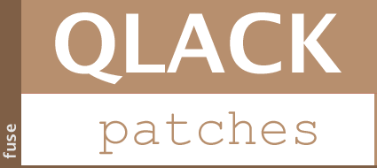

From time to time, currently shipping versions of third-party libraries
and tools may contain bugs or vulnerabilities; or just maybe a feature
we really need is not back-ported to the version we use. On this repo
we maintain patches to existing artifacts in order to include such
missing features or fixes until the upstream projects include them in
a production release.

By definition, sub-projects of this module must/should be short-lived, however
this is not always up to us. Once the upstream project includes whatever
we have incorporated into our patches into a production release we remove
our patch and replace it with the artifact from the upstream project.