This module provides seamless integration to your application with SAML-based SSO environments. It builds upon the excellent WebSSO support already available in Apache CXF's [JAX-RS: SAML Web SSO](http://cxf.apache.org/docs/saml-web-sso.html) and you are not required to use/integrate any third-party components such as PicketLink, Shibboleth, etc. Of course, being a QLACK module, it also integrates with various other QLACK components to provide you a modularised experience. One such example includes the usage of caching which can be dynamically replaced in your runtime environment in order to support single-server deployments (via [qlack2-fuse-caching-local](https://github.com/eurodyn/Qlack2/tree/master/Fuse/qlack2-fuse-caching/qlack2-fuse-caching-local)) or large clusters (via [qlack2-fuse-caching-memcached](https://github.com/eurodyn/Qlack2/tree/master/Fuse/qlack2-fuse-caching/qlack2-fuse-caching-memcached) and [qlack2-fuse-caching-redis](https://github.com/eurodyn/Qlack2/tree/master/Fuse/qlack2-fuse-caching/qlack2-fuse-caching-redis)).

# SSO/SAMLv2 primer

There are, literally, dozens of excellent guides on SSO/SAMLv2 and we encourage you to go ahead and educate yourself. As a minimum basis of understanding we provide here a quick introduction.

## SAML main concepts
* **IdP**, the Identity Provider (or Identity Assertion Provider), according to the OASIS organisation that created SAML, is defined as "A kind of provider that creates, maintains, and manages identity information for principals and provides principal authentication to other service providers within a federation, such as with web browser profiles". This is your OpenAM, WSO IDM, etc.
* **SP**, the Service Provider, is "A role donned by a system entity where the system entity provides services to principals or other system entities". This is your application.
* **Federation**, is "An association comprising any number of service providers and identity providers.". This is an umbrella term with no specific technical counterparts.

* **SAML Request**, or AuthnRequest, is an XML representing an SP's wish to authenticate a user. This XML is prepared by the SP and it is sent to the IdP. The XML contains various optional and mandatory sections, including a digital signature.
* **SAML Response**, or SAML Token, is an XML representing a user that was just authenticated with the IdP. The XML contains various information about the IdP, the user (together with various attributes about the user), as well as a digital signature.
* **SAML Assertion/Attribute/Claim** refer to several different types of information available within a SAML Response XML, usually, providing you information about the user that was just authenticated.
* **SSO Filter** is a mechanism on the SP-side, usually in the form of a request filter, to initiate the SSO flow.
* **RACS**, the Response Assertion Consumer Service, is the component on the SP-side receiving the SAML Response. This may be an individual component or be an internal part of the SSO Filter. Once the RACS verifies the received SAML Response it redirects the user back to the originally asked resources; it may also  be implemented as a filter, thus no redirect is necessary.

## Working with an SSO session
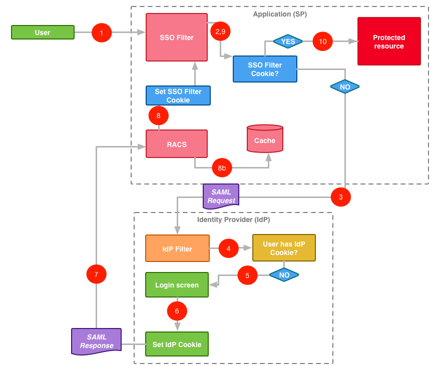

### First-time access  
* Step 1
	* The user tries to access your application for the first time.  
	* The SSO Filter intercepts the incoming request.
* Step 2
	* The SSO Filter checks if this user has already authenticated with the application by checking a Cookie previously set.
	* The user has never authenticated with the application since the SSO Filter can not be found.
* Step 3
	* The SSO filter creates a SAML Request and redirects the user back to the IdP.
* Step 4
	* The IdP Filter check if the user has previously authenticated with the IdP by checking a Cookie previously set.
	* The user has never authenticated with the IdP.
* Step 5
	* The IdP shows a log-in screen to the user.
* Step 6
	* Use successfully logs-in.
	* The IdP sets a Cookie to identify this user in the future.
* Step 7
	* The IdP prepares a SAML Response and redirects the user back to application's RACS.
* Step 8
	* The RACS processes the request, updates the local cache with the information on the SAML Response, sets a cookie for the SSO Filter to identify this user in the future and redirects the user back to the originally asked resource.
* Steps 9, 10
	* SSO Filter intercepts the request but this time the Cookie is found, so the user is allowed to access the protected resource.

### Subsequent access after authentication
As soon as the user hits the SSO Filter after step (2), the filter extract the Cookie from the user, checks whether a SAML Response is available in the cache for this Cookie and allows the user to proceed.

## Expirations, Cookies and caches
When working with SAML in your modern, stateless application, there are a couple of things about expirations that you should keep in mind.

### IdP Cookie
The Cookie set by the IdP is useful as it allows the IdP to identify previously authenticated users and not show log-in screens unnecessarily. You need to understand that this Cookie identifies a specific user to the IdP **only** and not to your application as the user may have visited the IdP because he/she was trying to access another application under the same Federation scheme. If the user has managed to authenticate with the IdP in just any of the applications participating in the Federation then the IdP will automatically provide the details of this user to any other application asking so. This is how you effectively achieve SSO.

As soon as the IdP Cookie is expired (or removed) when the user will be redirected back to the IdP he/she will have to go through the log-in screen. Your application does not control the expiration details of the IdP Cookie, so if you need to change this you need to ask the administrators of the IdP.

### SP Cookies
What needs to be clear early on is that your application does not access the IdP at every single user request. That would not only be an overkill for the IdP but would also impose significant delay in processing user requests. However, if not every single user request is not checked with the IdP, how does your application know a/ Is this user previously authenticated?, and b/ What are the SAML attributes for the user? By using SP Cookies. Let us examine what are such Cookies and where/how/when are generated.

The first time the user is accessing your application it does not, obviously, have any SP Cookie, so it is naturally redirected to the IdP to be authenticated against. During such redirect your SSO Filter creates a `RelayState` object and stores it on its local cache. The key of the `RelayState` is a UUID which uniquely identifies it and its value is similar to the `state` object below:

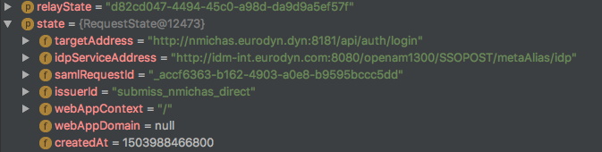

The SSO Filter also stores a Cookie with name `RelayState` and value the UUID created above before redirecting you back to the IdP. As part of the SAML specification, the IdP will return this Cookie once the user is authenticated together with the SAML Response. Therefore, the `RelayState` Cookie serves as an additional security mechanism for your application to know that a SAML Response received is related to an actual authentication attempts that took place previously originated by your application. You can influence the amount of time the `RelayState` Cookie remains active (i.e. not-expired) by setting the `stateTimeToLive` property in the configuration of your SSO Filter (e.g. `SamlPostBindingFilter`, etc.). Of course, be aware that a similar expiration time should also be setup in the cache used by your application.

However, the `RelayState` Cookie alone is not enough for your application to properly identify the user. The extra piece of information that is of real value to your application are the details embedded into the SAML Response and these are not stored in the `RelayState` object available in your local cache. This information is stored on a separately cached object identified by a different Cookie, the `org.apache.cxf.websso.context`. But let us first see where and when this second SP Cookie is created.

Once the user is properly authenticated with the IdP, the IdP redirects the user back to the RACS service of your application. RACS validates the SAML Response and checks that a `RelayState` object matching the value of the `RelayState` Cookie is available in your local cache. If everything checks OK, it creates a "security context" identified by a UUID which is also stored in your local cache as:

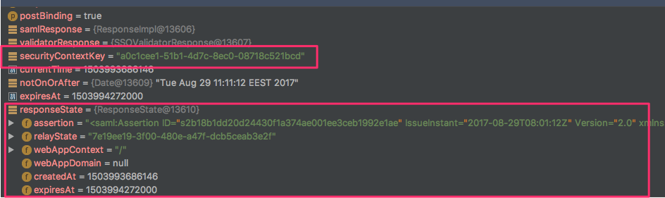

As you can see, among other pieces of information, the complete SAML response is held in your local cache. The identifier for this value in your cache is stored in your browser under the `org.apache.cxf.websso.context` Cookie as:

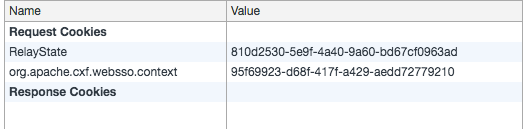

The next time the user is trying to access a protected resource it is this exact Cookie that will be looked up by the SSO Filter to decide whether this is a known user or not. If the Cookie is found and the value identified by its value (e.g. the UUID) can be looked up successfully in your local cache, the user is considered already-authenticated and the original SAML details with which the user was authenticated with are retrieved from the cache. You can influence the amount of time the `org.apache.cxf.websso.context` Cookie remains active (i.e. not-expired) by setting the `stateTimeToLive` property in the configuration of the RACS (e.g. `com.eurodyn.qlack2.util.sso.RACS`, etc.). Of course, be aware that a similar expiration time should also be setup in the cache used by your application.


## Digital signatures, Encryptions and Keys
By this point you should have probably realised that SAMLv2 SSO is based in exchanging XML files. It would be therefore trivial for an attacker to just pretend to be an IdP replying back to an SP sending modified/hacked XML replies. And vice versa; a malicious application could try to brute force passwords by sending requests to the IdP. Luckily none of these happens as XMLs contain digital signatures and encrypted elements.

Explaining exactly how and what is signed and/or encrypted lies far beyond the scope of this short introduction, however the main points you should be aware of are:

* SAML Requests are digitally signed by the SP.
* In case the SP uses a self-signed certificate that the IdP can not trust, you need to import the SP's key into the IdP.
* SAML Responses are digitally signed by the IdP.
* In case the IdP uses a self-signed certificate that the SP can not trust, you need to import the IdP's key into the IdP.

# Configuration
## A. Preparation
IdPs, Cookies and `localhost`/`127.0.0.1` are notoriously incompatible. In fact, OpenAM will not even allow you to set it up using IP addresses and your mileage may vary using `localhost`. For a consistent experience, make sure you either use a fully qualified domain name (FQDN) or edit your `hosts` file to create an entry for an imaginary domain; this is what we are using on this guide the:  

`FQDN`

## B. Setting up the IdP
You may choose any of the available Identity Management solutions, however on this guide we will be using OpenAM. Please note that the installation described below is only for development/test environments.

* Download [OpenAM 13.0.0 Enterprise](https://backstage.forgerock.com/downloads/OpenAM/OpenAM%20Enterprise/13.0.0#browse) WAR.
* Download [Tomcat 8](http://tomcat.apache.org/download-80.cgi). Make sure you do not download a version newer than 8.0.44.
* Rename the WAR file to `openam1300.war`.
* Startup Tomcat and copy the WAR file into `webapps` (note that OpenAM also creates an `openam1300` folder in the home directory of your user.):  

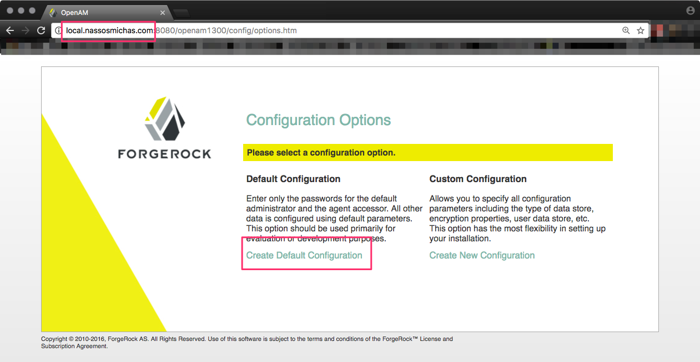  
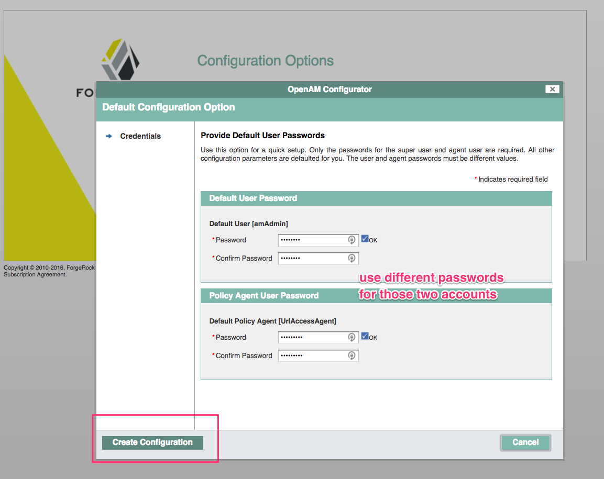  
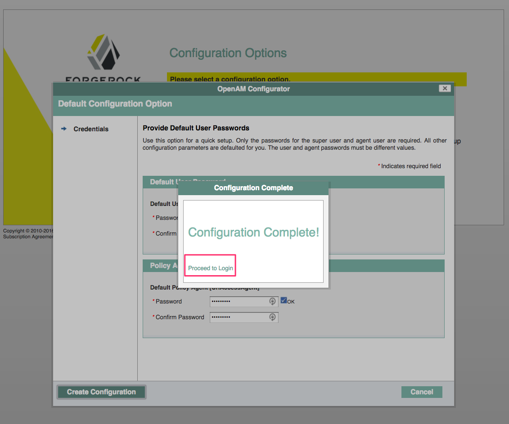  
  
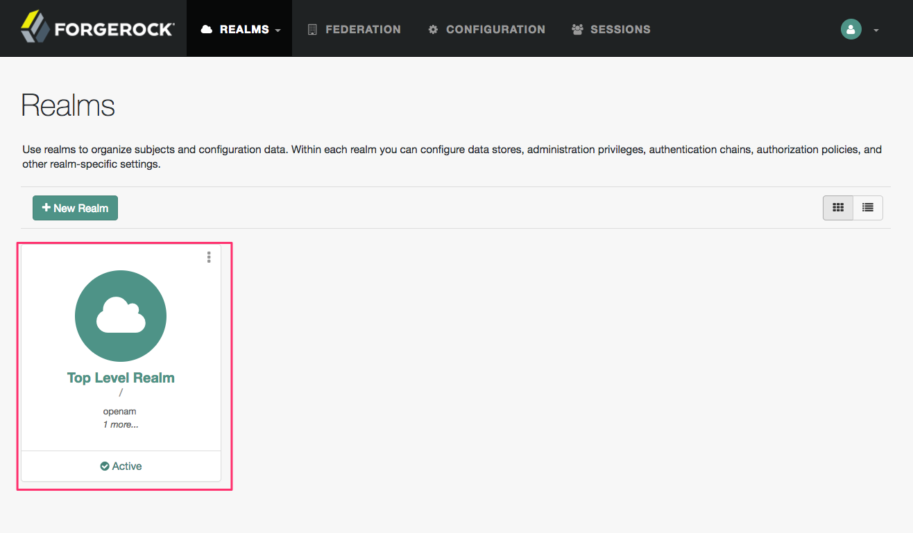  
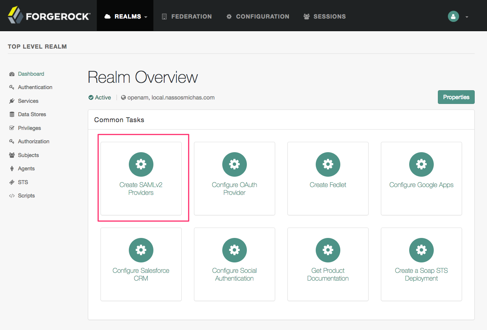  
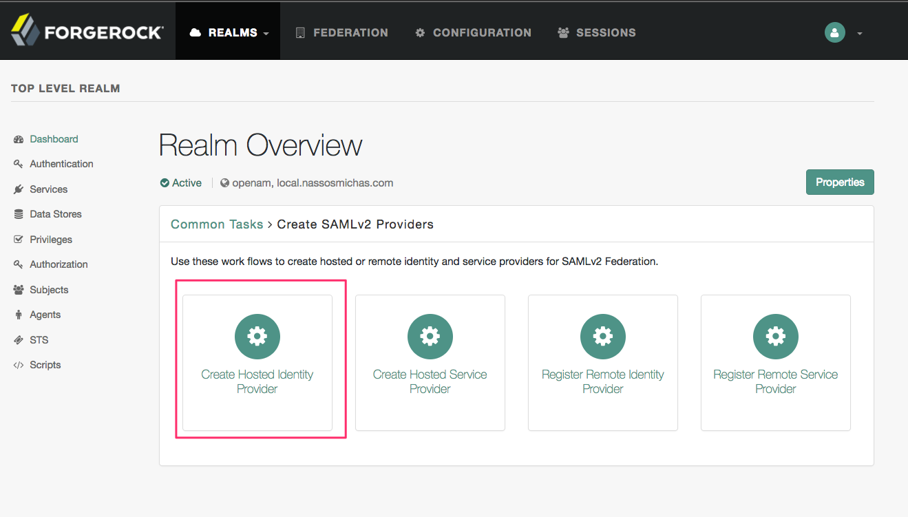  
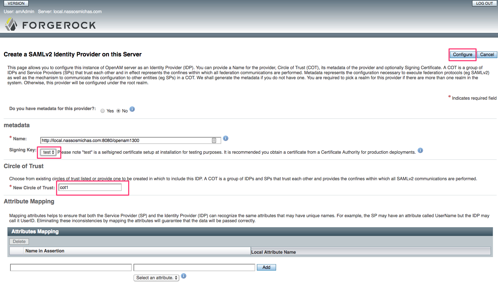  

At this point you have successfully setup the IdP. Now it is time to register your SP too. You can do this by hand, providing all the necessary information in OpenAM's console, however we will show you how you can do that automatically. For that, we need to configure our application as an SP first.

## B. Setting up the SP
### Certificates and Keystores
You will need to configure a few different files to setup your SP. It is suggested that those files are placed in a directory outside of your source code as well as your local Karaf/app server installation. For this guide, we chose `/etc/project1`.
Create a local keystore:  
`keytool -genkey -alias keystore_alias -keyalg RSA -keysize 2048 -keystore keystore.jks `

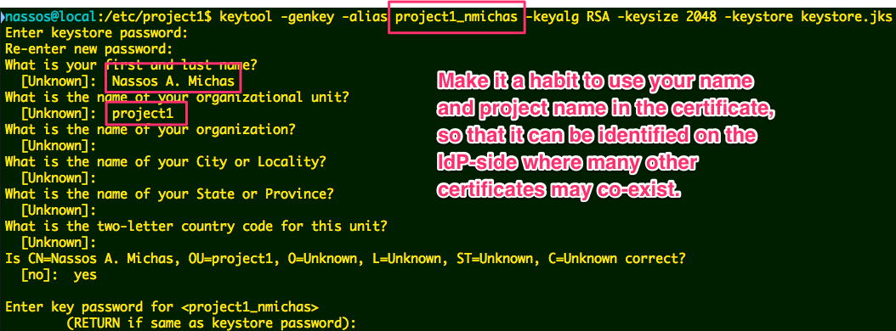  

Fetch IdP's certificate:  
```echo -e "-----BEGIN CERTIFICATE-----\n" `curl -s 'http://FQDN:8080/openam1300/saml2/jsp/exportmetadata.jsp' | xmllint --xpath "//*[local-name()='X509Certificate']/text()" -` "\n-----END CERTIFICATE-----" | sudo tee -a idp.crt > /dev/null```

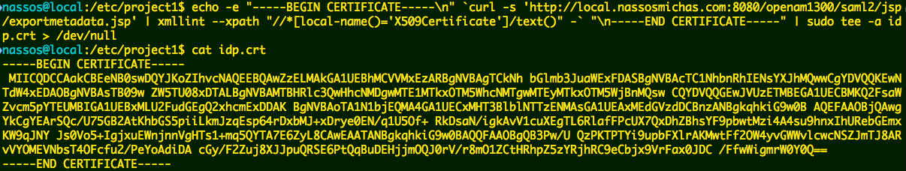  

Import IdP's certificate into the keystore:  
`keytool -importcert -file idp.crt -alias idp -keystore keystore.jks`

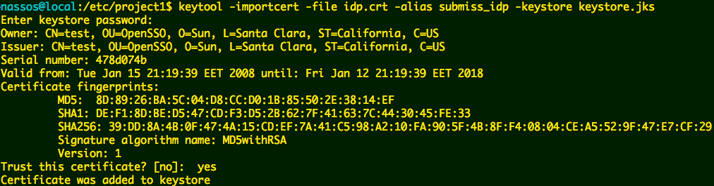  

Check your keystore contains all certificates:  
`keytool -list -keystore keystore.jks`

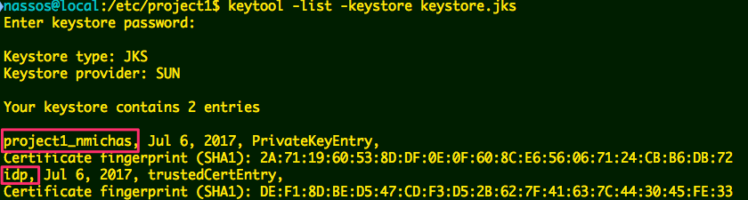  

Export your SP's certificate in order to import it into the IdP's keystore:  
`keytool -export -keystore keystore.jks -alias keystore_alias -file project1.cer`

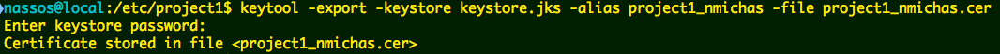  

Go to the location where OpenAM's configuration resides (e.g. `~/openam1300/openam1300`) and execute (OpenAM's default keystore password is `changeit`):  
`keytool -importcert -file /etc/project1/project1.cer -alias keystore_alias -keystore keystore.jks`

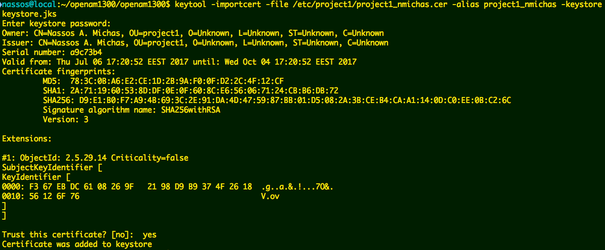  

Verify OpenAM's keystore contains all necessary certificates:  
`keytool -list -keystore keystore.jks`

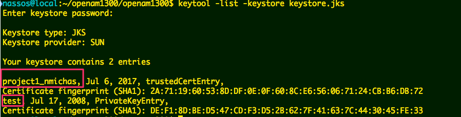  


### Application configuration

#### Karaf Features required
Make sure your application uses `qlack2-util-sso` feature.

#### Blueprint configuration
```
<!-- SSO ************************************************************************************* -->
  <!-- Caching implementation -->
  <reference id="CacheService" interface="com.eurodyn.qlack2.fuse.caching.api.CacheService"
    ext:proxy-method="classes"/>

  <!-- Request/Response state manager -->
  <bean id="stateManager" class="com.eurodyn.qlack2.util.sso.SPStateCache">
    <property name="cacheService" ref="CacheService"/>
    <property name="keyPrefix" value="project1:sso:state:"/>
  </bean>

  <!-- A Callback handler to be used by CXF when it needs to obtain the password of the keystore -->
  <bean id="callbackHandler" class="com.eurodyn.qlack2.util.sso.CBHandler" init-method="init">
    <property name="signaturePropertiesFile" value="${sso.signaturePropertiesFile}"/>
  </bean>

  <!-- A token replay avoidance mechanism -->
  <bean id="tokenReplayCache" class="com.eurodyn.qlack2.util.sso.PluggableTokenReplayCache">
    <property name="cacheService" ref="CacheService"/>
    <property name="keyPrefix" value="project1:sso:replay:"/>
  </bean>

  <!-- SSO GET-redirect filter for SP initiated authentication -->
  <!-- SamlRedirectBindingFilter, SamlPostBindingFilter, and FakeFilter are mutually exclusive -->
  <bean id="SSOFilter"
    class="org.apache.cxf.rs.security.saml.sso.SamlRedirectBindingFilter">
    <property name="idpServiceAddress" value="${sso.idpServiceAddress}"/>
    <property name="assertionConsumerServiceAddress" value="${sso.assertionConsumerServiceAddress}"/>
    <property name="stateProvider" ref="stateManager"/>
    <property name="addEndpointAddressToContext" value="true"/>
    <property name="signRequest" value="true"/>
    <property name="signatureUsername" value="${sso.signatureUsername}"/>
    <property name="signaturePropertiesFile" value="${sso.signaturePropertiesFile}"/>
    <property name="callbackHandler" ref="callbackHandler"/>
    <!--<property name="issuerId" value="some-custom-id-if-your-idp-asks-you-to-define-it"-->
  </bean>

  <!-- SSO POST-redirect filter for SP initiated authentication -->
  <!-- SamlRedirectBindingFilter, SamlPostBindingFilter, and FakeFilter are mutually exclusive -->
  <bean id="SSOFilter" class="org.apache.cxf.rs.security.saml.sso.SamlPostBindingFilter">
    <property name="idpServiceAddress" value="${sso.idpServiceAddress}"/>
    <property name="assertionConsumerServiceAddress" value="${sso.assertionConsumerServiceAddress}"/>
    <property name="stateProvider" ref="stateManager"/>
    <property name="addEndpointAddressToContext" value="true"/>

    <property name="signRequest" value="true"/>
    <property name="signatureUsername" value="${sso.signatureUsername}"/>
    <property name="signaturePropertiesFile" value="${sso.signaturePropertiesFile}"/>
    <property name="callbackHandler" ref="callbackHandler"/>
    <!--<property name="issuerId" value="some-custom-id-if-your-idp-asks-you-to-define-it"-->
  </bean>

   <!-- A fake filter bypassing all SSO -->
   <!-- SamlRedirectBindingFilter, SamlPostBindingFilter, and FakeFilter are mutually exclusive -->
   <bean id="SSOFilter" class="com.eurodyn.qlack2.util.sso.FakeSSOFilter">
       <property name="fakeAttributes">
         <list>
           <value>uid</value> <value>user1</value>
           <value>mail</value> <value>user1@example.com</value>
         </list>
       </property>
   </bean>

  <!-- The RACS responsible to parse the SAML Response from the Idp -->
  <bean id="consumerService" class="org.apache.cxf.rs.security.saml.sso.RequestAssertionConsumerService">
    <property name="stateProvider" ref="stateManager"/>
    <property name="enforceKnownIssuer" value="false"/>
    <property name="signaturePropertiesFile" value="${sso.signaturePropertiesFile}"/>
    <property name="enforceResponseSigned" value="true"/>
    <property name="enforceAssertionsSigned" value="true"/>
    <property name="callbackHandler" ref="callbackHandler"/>
    <property name="replayCache" ref="tokenReplayCache"/>
  </bean>

  <!-- SSO metadata service allowing quick and easy registration of the SP to the IdP -->
  <bean id="metadataBean" class="com.eurodyn.qlack2.util.sso.CustomMetadataService">
    <property name="serviceAddress" value="${sso.serviceAddress}"/>
    <property name="assertionConsumerServiceAddress" value="${sso.assertionConsumerServiceAddress}"/>
    <property name="logoutServiceAddress" value="${sso.logoutServiceAddress}"/>
    <property name="signatureUsername" value="${sso.signatureUsername}"/>
    <property name="signaturePropertiesFile" value="${sso.signaturePropertiesFile}"/>
    <property name="callbackHandler" ref="callbackHandler"/>
    <property name="skipSignature" value="${sso.skipSignatureInMetadata}"/>
  </bean>

  <!-- Interceptors to make the attributes of the SAML available to the application -->
  <bean id="WebSSOCookieInterceptor" class="com.eurodyn.qlack2.util.sso.interceptors.WebSSOCookieInterceptor">
    <property name="stateProvider" ref="stateManager"/>
  </bean>
  <bean id="WebSSOCookieInterceptorCleanup" class="com.eurodyn.qlack2.util.sso.interceptors.WebSSOCookieInterceptorCleanup"/>

  <!-- A separate JAXRS server in which no filtering takes place -->
  <jaxrs:server id="Project1SSOMetadataRestServer" address="/saml">
    <jaxrs:serviceBeans>
      <ref component-id="metadataBean"/>
      <ref component-id="consumerService"/>
    </jaxrs:serviceBeans>
  </jaxrs:server>
<!-- /SSO ************************************************************************************ -->
```

In your existing JAX-RS server, you should also add the following configuration:

```
...

<jaxrs:inInterceptors>
	<ref component-id="WebSSOCookieInterceptor"/>
	<ref component-id="ValidationInInterceptor"/>
</jaxrs:inInterceptors>
<jaxrs:outInterceptors>
	<ref component-id="WebSSOCookieInterceptorCleanup"/>
</jaxrs:outInterceptors>

...

<jaxrs:providers>
  <!-- SSO ********************************************************************************* -->
	  <!-- The SP initiated authentication redirect filter -->
	  <ref component-id="SSOFilter"/>
	  <!-- A provider rendering an auto-submitted form for POST-redirect filter only -->
	  <bean id="SAMLRequestInfoProvider" class="com.eurodyn.qlack2.util.sso.SamlRequestInfoProvider"/>
  <!-- /SSO ******************************************************************************** -->
</jaxrs:providers>

...
```

You also need a properties file in which you keep the details of your keystore to be read
by CXF's components to create and verify digital signatures. Create a file
`/etc/project1/saml-sp.properties` as:

```
org.apache.ws.security.crypto.merlin.keystore.type=jks
org.apache.ws.security.crypto.merlin.keystore.password=mysecret
org.apache.ws.security.crypto.merlin.keystore.alias=keystore_alias
org.apache.ws.security.crypto.merlin.keystore.file=/etc/project1/keystore.jks
```
We are almost there! As you have seen above, the blueprint configuration contains
many references to variables. This is to allow you to deploy your application in
different environments just by changing external configuration files. Therefore,
your application should be able to read a config-admin .cfg with the following variables:

```
# ######################
# SAML/SSO configuration
# ######################
# The entity ID of this SP.
sso.serviceAddress = http://FQDN:8181/api/

# The URL of the IdP.
sso.idpServiceAddress = http://FQDN:8080/openam1300/SSORedirect/metaAlias/idp

# The global logout URL of the IdP.
sso.idpLogoutAddress = http://FQDN:8080/openam1300/SSORedirect/metaAlias/idp

# The URL of the service endpoint consuming the SAML Response on the SP.
sso.assertionConsumerServiceAddress = http://FQDN:8181/api/saml/sso

# The URL of the global logout service endpoint.
sso.logoutServiceAddress =  http://FQDN:8181/api/sso/logout

# The name of the entry in the keystore (e.g. alias) holding the key with which this SP signs.
sso.signatureUsername = keystore_alias

# The location in disk of the properties of the keystore.
sso.signaturePropertiesFile = /etc/project1/saml-sp.properties

# Whether to include a signature section in the metadata creation or not.
sso.skipSignatureInMetadata = true

# The URL to redirect to after a logout.
sso.mainApplicationAddress = http://FQDN:8181
```

### Using SAML attributes
Once the user is authenticated with the IdP and back to your application, you can find all
attributes defined in the SAML Response by using the `com.eurodyn.qlack2.util.sso.dto.WebSSOHolder`
class. Here is an example:

```
@Path("/auth")
public class LoginResource {
  @GET
  @Path("/test")
  @Produces(MediaType.APPLICATION_JSON)
  public Response get() {
    return Response.ok(WebSSOHolder.getAttributes()).build();
  }
}
```

# Dynamic filter configuration
FakeSSO Filter provides the possibility to dynamically set SAML attributes from the SP. 
To facilitate this functionality you simply need to append the SAML attributes you need to use as parameters in your requests.
Since the attributes will be stored in a map with the ID of the Cookie as the key, you only need to initiate such a request once 
and initiate another request with the appropriate parameters in case you want to use other SAML attributes, for instance if you need 
to perform tests for authorization in your application with different roles.
