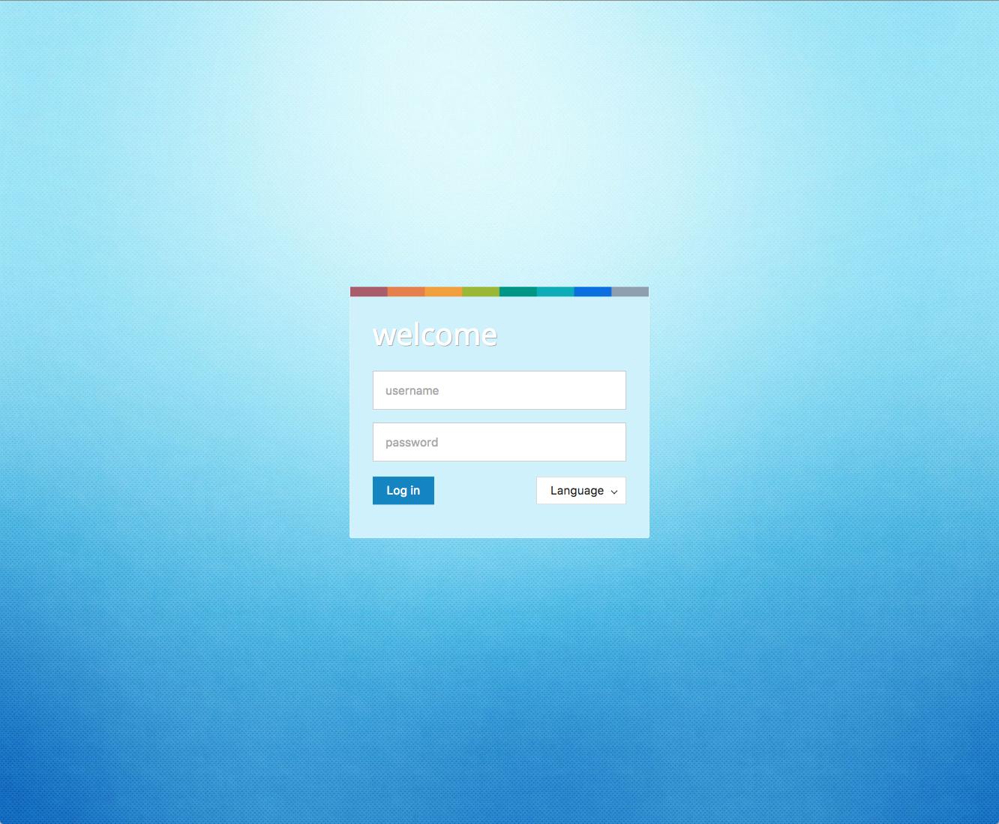

#Qlack2 Web Desktop

This is the barebones Web Desktop environment upon which other applications are 
built. There is little use to build and deploy it standalone but if you are
curious how it looks like you may follow the procedure below.

## Installation
1. Startup your Apache Karaf
2. Add the WD features repo  
`feature:repo-add mvn:com.eurodyn.qlack2.webdesktop/qlack2-wd-karaf-features/2.0.0/xml/features`
3. Install the default configuration files.   
`feature:install qlack2-wd-config`  
Note these expect a MySQL database to be locally available,
listening on port 14509, with a user 'root' with password 'root'. You can simply start such a database
using Docker:  
 `docker run -d --restart=always -p 14509:3306 --name mysql-webdesktop -e MYSQL_ROOT_PASSWORD=root mysql:5.7.12`
4. Install WD  
`feature:install qlack2-wd`

## Authentication
WD comes with no users built-in, so you need to create one first:  
`qlack:aaa-user-add user1 pass1 true 1`

## Access
[http://localhost:8181](http://localhost:8181)